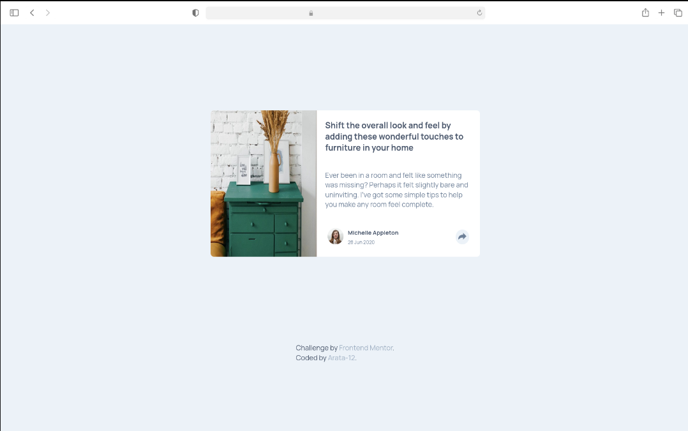
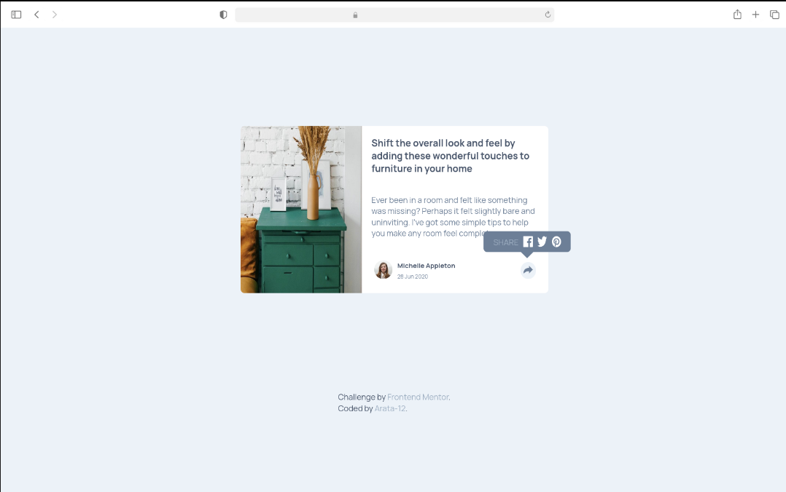
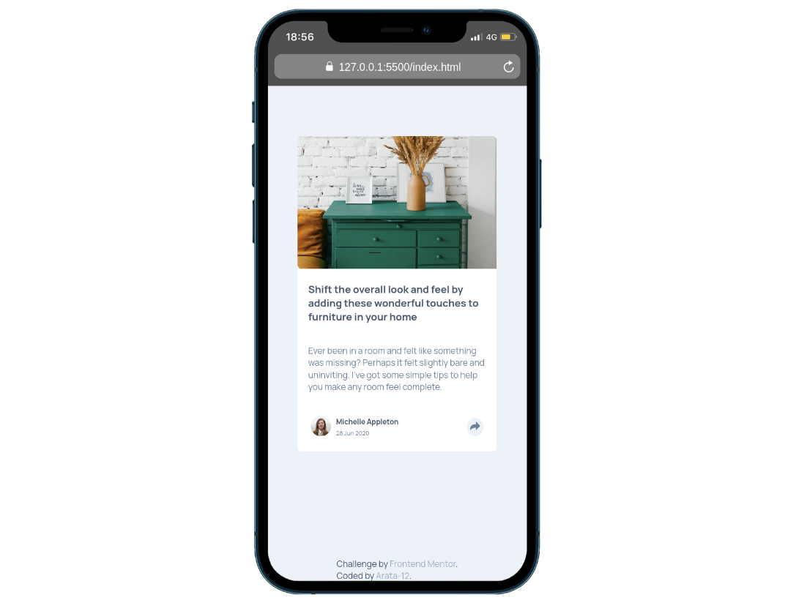
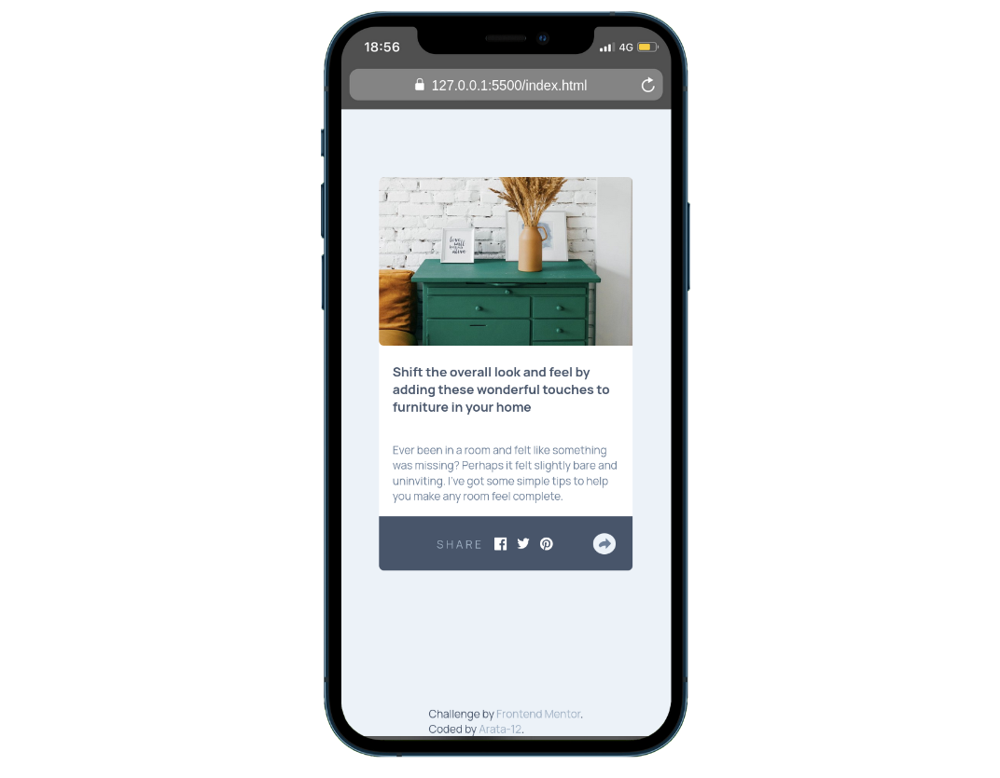

# Frontend Mentor - Article Preview Component

This is a solution to the Article Preview Component challenge on Frontend Mentor. The challenge demonstrates the implementation of an interactive article preview card with a social share feature.

## Overview

### The Challenge

Users should be able to:

- View the optimal layout for the component depending on their device's screen size
- See the social media share links when they click the share icon

### Built with

- Semantic HTML5 markup
- CSS custom properties (variables)
- Flexbox
- Mobile-first workflow
- Vanilla JavaScript for interactivity

### Key Features

- Responsive design that adapts to mobile (≤480px) and desktop views
- Interactive share button with different states:
  - Desktop: Shows a popup with social media links
  - Mobile: Transforms the bottom section into a social sharing bar
- Smooth transitions between states
- CSS custom properties for consistent color theming

### Implementation Details

- Uses CSS custom properties for color management
- Implements mobile-first responsive design
- JavaScript toggle functionality for share button interactions
- Dynamic layout changes based on viewport width
- Semantic HTML structure for better accessibility

### Screenshot

### Live Site
https://arata-12.github.io/article-preview-component-master/
